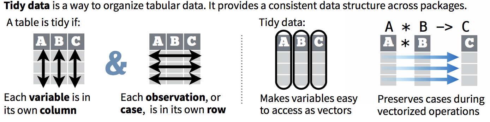
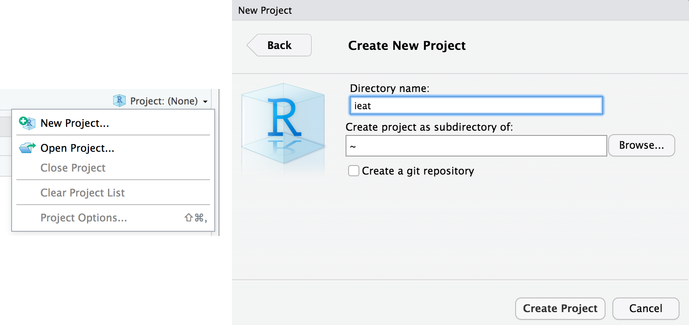
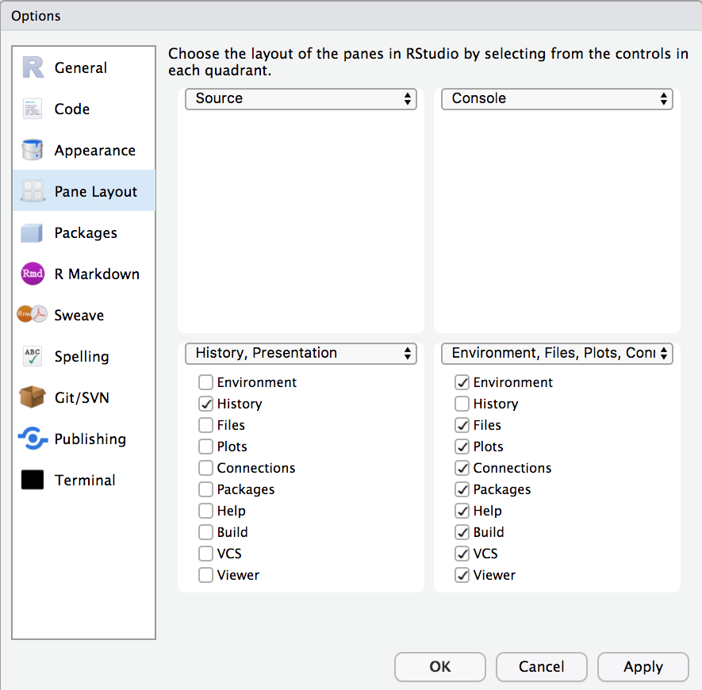
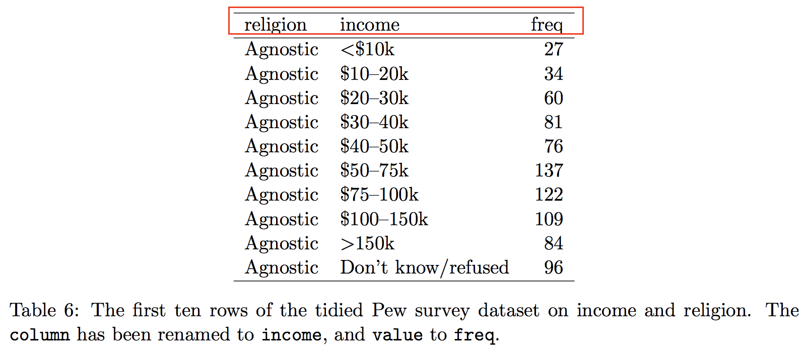
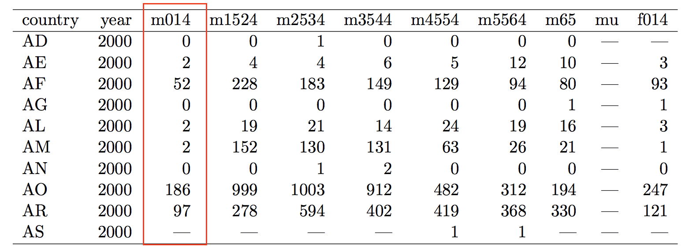
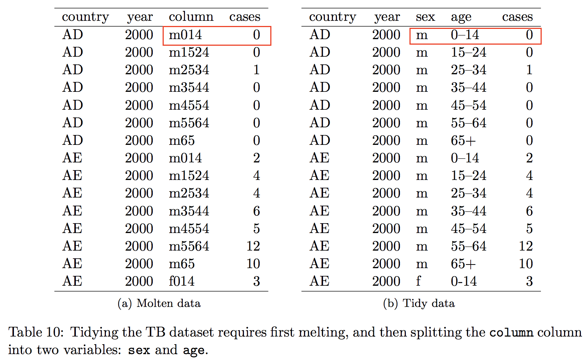
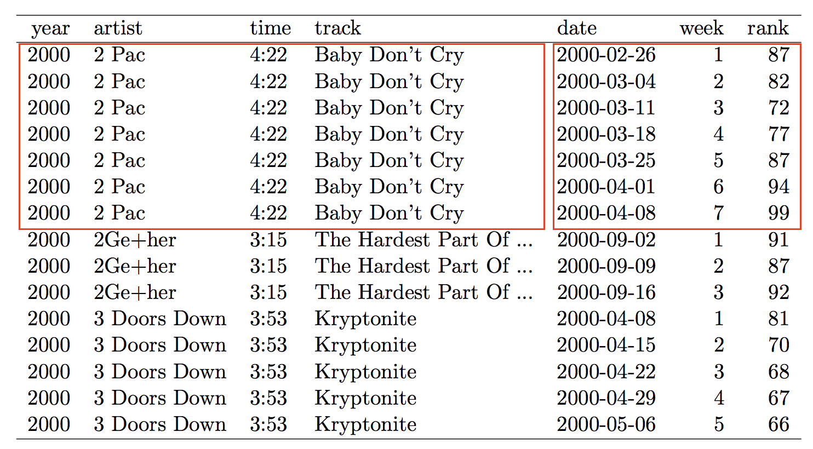
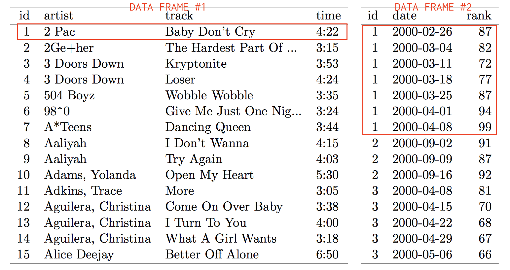

## {data-background="w05-cover.jpg"}

<style type="text/css">
p { text-align: left; }
</style>

## Last week

We learned the big 5 data transformation functions in the `dplyr` package:

function      purpose
--------      --------
`filter()`    Pick observations by their values
`arrange()`   Reorder the rows
`select()`    Pick variables by their names
`mutate()`    Create new variables
`summarise()` Create summaries

(http://r4ds.had.co.nz/transform.html)

## Last week

And we used these functions to create this plot:

<center>

</center>

## Today we'll focus on tidy data

<center>

</center>

https://www.rstudio.com/resources/cheatsheets/

## Objectives 

By the end of this session, you should be able to:

* Explain what makes data "tidy", and why messy data suck
* Tidy data using the `tidyr` package, a member of the tidyverse

## Login to Duke's Docker-ized version of RStudio Server

* Login to your instance by going to [https://vm-manage.oit.duke.edu/containers](https://vm-manage.oit.duke.edu/containers) and entering your NetID. 
* Click on Docker
* Click on RStudio
* When RStudio loads, restart the R session (`Ctrl/Cmd+Shift+F10`), clear the console (`Ctrl/Cmd+L`), and clear your workspace 

## Open your project

Is your project still open? If not, click on the project icon to load it. (Don't create a new one.)

<center>

</center>

## Optional: Change your layout

`Tools > Global Options`

<center>

</center>

## Tidy Data

> Tidy datasets are easy to manipulate, model and visualize, and have a specific structure: each variable is a column, each observation is a row, and each type of observational unit is a table [@wickham2014] 

Wickham also uses tidy as a verb meaning "to structure a dataset to facilitate analysis".

## Messy Data 1: Column Headers Are Values

<center>

</center>

How many variables are in this dataset? This table and the following from @wickham2014.

## Tidy Data 1: Melt

Columns are variables and rows are observations (i.e., combination of religion and income):

<center>

</center>

## Messy Data 2: Multiple variables stored in one column

<center>

</center>

How would you link up with population data by country and age group to calculate rates? (*answer: after tidying*)

## Tidy Data 2: Melt and Split

<center>

</center>

## Messy Data 3: Variables are stored in both rows and columns

<center>

</center>

The `element` column is not a variable with values, but rather a vector of variable names.

## Tidy Data 3: Melt and Cast

Every row becomes an observation (i.e., weather station by date) with two measurements:

<center>

</center>

## Messy Data 4: Multiple types in one table

This style of data entry and storage invites errors and inconsistencies:

<center>

</center>

## Tidy Data 4: Use different tables for different levels

<center>

</center>

## <span style="color:red">Don't Cry, Tidy!</span> {data-background-image="https://media.giphy.com/media/E2uKqBQURFHfG/giphy.gif"}

## The Tidy 4

function      purpose
--------      --------
`gather()`    Gather variable values spread across multiple columns
`spread()`    Spread out observation values scattered across rows 
`separate()`  Split one column into two or more columns
`unite()`     Collapse multiple columns into one column

(http://r4ds.had.co.nz/tidy-data.html)

## Some Simple Examples

Load the `tidyverse` package and look at the included dataset called `table4a`.

```{r, message=FALSE}
  library(tidyverse)
  table4a
```

What is messy about this tibble?

## `gather()`

1999 and 2000 are values, not variables. The variable should be `year`.

<center>

</center>

Examples and figures from @wickham2017

## `gather()`

```{r}
  table4a %>%  # remember pipes?
    gather(`1999`, `2000`, key = "year", value = "cases")
```

We gather values by a set of column names that define the `key`, which we name `year`. We then store the values in a new variable called `cases`.

## `gather()`

Try gathering `table4b` (also included with `tidyverse`) to create variables for year and population values (call it "population").

```{r}
  table4b
```

## `spread()`

Now look at `table2`. `type` is not a variable!

```{r}
  table2
```

## `spread()`

Let's use `spread()` to make two proper variables: `cases` and `population`.

<center>

</center>

## `spread()`

The `key` in this example is the `type` column, and the values we want to spread are stored in `count`.

```{r}
  table2
```

## `spread()`

Just like with `gather()`, we'll pass two arguments to `spread()` in addition to an object: `key` and `value`.

```{r}
  spread(table2, key = type, value = count)
```

## <span style="color:red">`spread` out wide, or `gather` (stack) into a long (tall) pile</span> {data-background-image="https://media.giphy.com/media/Oi9xgpNEiI8us/giphy.gif"}

## split and combine columns

The `separate()` and `unite()` functions split and combine columns.

## `separate()`

Here we want split `rate` into two columns: `cases` and `population`

<center>

</center>

## `separate()`

It's simple. Just tell R the column to split and the columns to create:

```{r}
  table3 %>% 
    separate(rate, into = c("cases", "population"))
```

## `separate()`

`separate()` is smart enough to know to split on "/", but you can also specify with `sep = "/"`. The `convert==TRUE` argument will guess at the data type rather than leave the new columns characters.

```{r}
  table3 %>% 
    separate(rate, into = c("cases", "population"), 
             sep="/", convert = TRUE)
```

## `separate()`

Can also separate on a specific character position with the `sep` argument. For example, we separate `year` into `century` and `year` by specifying `sep==2`. Count from left (1, 2, ...) or from right (-1, -2, ...).

```{r}
  table3 %>% 
    separate(rate, into = c("century", "year"), 
             sep=2, convert = TRUE)
```

## `unite()`

`unite()` does the opposite: it combines two or more columns into one.

<center>

</center>

## `unite()`

In this example, `new` is the name of the new column we want to create by combining columns `century` and `year`. 

```{r}
  table5 %>% 
    unite(new, century, year)
```

## `unite()`

By default `unite()` will add an underscore, but adding `sep=""` (no space) will combine without the `_`.

```{r}
  table5 %>% 
    unite(new, century, year, sep = "")
```

## Missing values

One last point to consider is how to handle missing values when transforming data. Let's make a tibble called `stocks` with 2 years of quarterly data on returns.

```{r}
  stocks <- tibble(
    year   = c(2015, 2015, 2015, 2015, 2016, 2016, 2016),
    qtr    = c(   1,    2,    3,    4,    2,    3,    4),
    return = c(1.88, 0.59, 0.35,   NA, 0.92, 0.17, 2.66)
)
```

## Missing values

There are two types of missing data: 

1. Explicit: Q4 of 2015 is present in the data, but there is no value.
2. Implicit: Q1 of 2016 is not even present in the data

## Make missing explicit

`complete()` returns all combinations of a set of columns and will fill in `NA` when combinations are missing.

```{r}
  stocks %>% 
    complete(year, qtr)
```

## References

